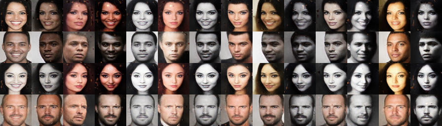

# SD-GAN Tensorflow

Implementation of *Semantically Decomposing the Latent Spaces of Generative Adversarial Networks* ([arXiv](https://arxiv.org/abs/1705.07904), [demo](https://chrisdonahue.github.io/sdgan)).

Semantically decomposed GANs (SD-GANs) learn a decomposed latent space separating *identity* from the other contingent aspects of *observations*. In our [paper](https://arxiv.org/pdf/1705.07904.pdf), we demonstrate that SD-GANs can disentangle factors of variation corresponding to identity from photographs of celebrity faces and shoes. SD-GANs are especially applicable for datasets with *many labels* but *few observations* of each. Example results from an SD-GAN model; each row shares an identity and each column shares contingent factors:

<p align="center">
	
</p>

## Instructions

Download one or both of the compressed datasets to `sdgan/data`:

* [MS-Celeb-1M faces (12k IDs)](https://drive.google.com/open?id=0B39A_Ur1O27EellNblFTVy11WTg)
* [Shoes (4k IDs)](https://drive.google.com/open?id=0B39A_Ur1O27ENDVpelRwclg2VWc)

Run training:

1. Navigate to: `sdgan/data`
1. Extract a dataset: `tar xvfz msceleb12k.tar.gz`
1. Navigate to: `sdgan`
1. Run training: `./train_{dcgan,began}.sh`
1. Navigate to: `sdgan/train`
1. (*Optional*) Run grid visualization: `./prev.sh`
1. Run tensorboard: `tensorboard --logdir=.`

### Requirements

* `tensorflow (>= 1.0)`
* `numpy`

### Adding new datasets

To add new datasets, follow the naming convention in the prepackaged ones above. Dataset folder must have subdirectory called `train`. `train` must contain 64x64 `png` files formatted as `<ID_NAME>_<OBS_NUMBER>_<?>.png`. In our datasets, `<?>` is the original aspect ratio for the source image of the 64x64 thumbnail, though the attribute is unused in our code.

## Attribution
If you use this dataset in your research, cite via the following BibTeX:

```
@article{donahue2017sdgan,
  title={Semantically Decomposing the Latent Spaces of Generative Adversarial Networks},
  author={Donahue, Chris and Balsubramani, Akshay and McAuley, Julian and Lipton, Zachary C},
  journal={arXiv:1705.07904},
  year={2017}
}
```

## Reference code/datasets

* [DCGAN](https://github.com/carpedm20/DCGAN-tensorflow)
* [BEGAN](https://github.com/carpedm20/BEGAN-tensorflow)
* [WGAN-GP](https://github.com/igul222/improved_wgan_training)
* [pix2pix](https://github.com/phillipi/pix2pix)
* [MS-Celeb-1M](https://www.microsoft.com/en-us/research/project/ms-celeb-1m-challenge-recognizing-one-million-celebrities-real-world/)
* [Amazon dataset](http://jmcauley.ucsd.edu/data/amazon/)

## Author

Chris Donahue ([website](https://chrisdonahue.github.io), [gscholar](https://scholar.google.com/citations?user=MgzHAPQAAAAJ&hl=en), [twitter](https://twitter.com/chrisdonahuey))
